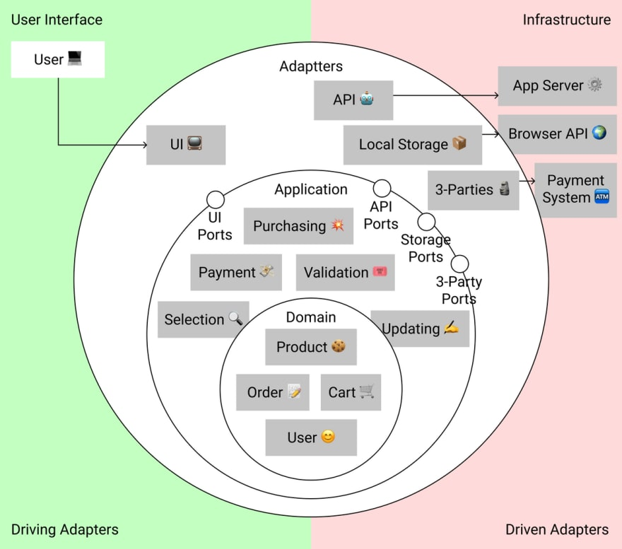

整体的架构关系



文件夹的目录结构
```
application 应用层
ui          用户界面层
domain      领域
lib         外部依赖
```


划分的领域(实体)
```
产品(Product)
  type Product  类型
  totalPrice    计算总价

订单(Order)
  type Order   类型
  createOrder  创建订单

购物车(Cart)
  type Cart     类型
  addProduct    添加商品
  contains      是否包含

用户(User)
  type User     类型
  hasAllergy    是否过敏
  hasPreference 是否偏好

application(用力模型):
  addToCart 添加到购物车
  orderProducts 订单商品

  ports接口：
    UserStorageService（用户数据存储）
    CartStorageService（购物车数据存储）
    OrdersStorageService（订单数据存储）
    AuthenticationService（API用户验证）
    NotificationService（通知服务）
    PaymentService（第三方支付服务）

```

driving adapters 驱动适配器
user interface   用户界面

<!-- domain -->
<!-- usecase -->
<!-- ports -->

<!-- 架构设计的原则： -->
<!-- 上层模块依赖于下层模块 -->
<!-- 同级别模块之间能进行依赖吗 -->


<!-- 领域或者实体 -->
<!-- 组织｜地址｜空间｜团队｜成员 -->

<!-- UI层 -->
<!-- application(ports) -->
<!-- domain -->