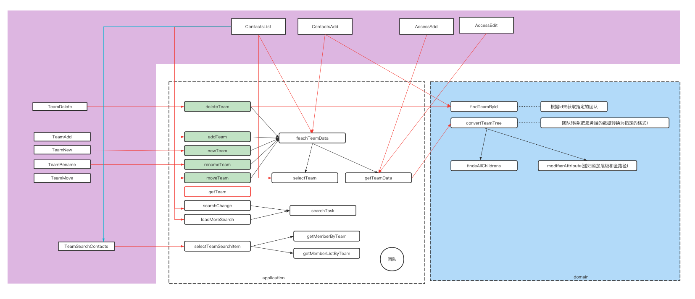

## 设计参考：

## 设计原则：

代码依赖的方向总是指向内部，越靠近内部抽象级别会越高。最外圈是低层次的具体细节，随着向内移动，软件变得更加抽象，并封装了更高级别的策略。最内圈是最基础的。

## 设计思考：

设计版本：
  第一版本：项目仅仅有结构，但是几乎没有软件设计，在组织代码的时候仅仅通过业务模块来分割。
 
  第二版本：参照整洁架构来进行设计，整体的结构如下图。
   

